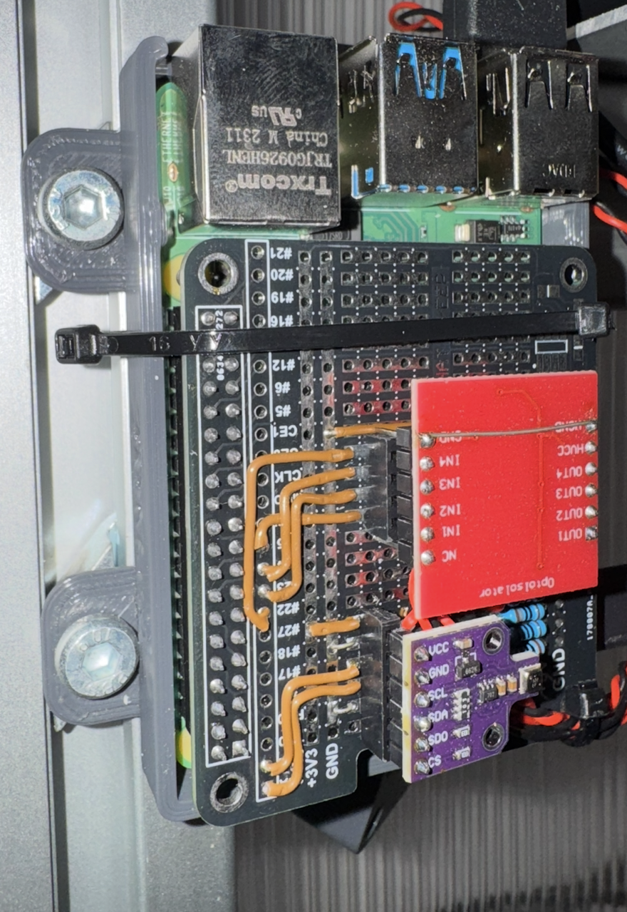

# OctoPrint-BME680ChamberTemp

`OctoPrint-BME680ChamberTemp` reads a genuine Bosch BME680 over I2C on a Raspberry Pi, shows temperature, relative humidity, and raw gas resistance in OctoPrint, and optionally injects the temperature into OctoPrint's default temperature graph using a configurable temperature name.

Features:

- configurable I2C bus and address, including `auto` mode for `0x76` and `0x77`
- configurable polling interval and temperature offset
- optional temperature injection into OctoPrint's default graph
- dedicated tab with live readings and diagnostics
- retry-based background worker that tolerates temporary sensor failures

## Supported hardware and assumptions

- Raspberry Pi running OctoPi / Raspberry Pi OS with I2C enabled
- Genuine Bosch BME680 on I2C
- Default tested address `0x76`; optional `auto` mode also tries `0x77`
- Default bus `1`
- OctoPrint 1.9+ and current supported Python 3 versions

This plugin does not support arbitrary environmental sensors.

## Hardware setup



Example installation with the BME680 mounted on a Raspberry Pi shield. The additional level shifter board shown in the photo is not part of the plugin requirements.

## Wiring assumptions

This plugin assumes the BME680 is wired to the Raspberry Pi's I2C bus, typically:

- `3V3`
- `GND`
- `SDA`
- `SCL`

Follow your board vendor's pinout and confirm the sensor is powered at the correct voltage.

## Enable I2C on Raspberry Pi

1. Enable I2C in Raspberry Pi configuration.
2. Confirm the interface is active in `/boot/config.txt` or the current Bookworm-equivalent configuration flow.
3. Verify the device appears on the expected bus, for example with `i2cdetect -y 1`.

This plugin does not change Raspberry Pi boot configuration automatically.

For setups that are more reliable with slower bus communication, the following `/boot/config.txt` settings have been used successfully:

```ini
dtparam=i2c_arm=on
dtparam=i2c_arm_baudrate=1000
dtparam=i2c_baudrate=1000
dtparam=spi=on
camera_auto_detect=1
start_x=1
gpu_mem=128
```

Only `i2c_arm` is required for this plugin. The reduced I2C baudrate can help if the sensor wiring or attached hardware is sensitive.

## Installation from GitHub

Install into the OctoPrint virtual environment:

```bash
~/oprint/bin/pip install "git+https://github.com/ekammerloher/OctoPrint-BME680ChamberTemp.git"
```

You can also install it from OctoPrint's Plugin Manager using a GitHub release archive URL.

For tagged releases, GitHub Actions automatically publishes release artifacts. In Plugin Manager, you can use the source archive URL for a tag or the generated GitHub release page.

## Configuration

Open OctoPrint settings and configure:

- I2C address: `0x76`, `0x77`, or `auto`
- I2C bus: defaults to `1`
- Polling interval: defaults to `5` seconds, minimum `1`
- Temperature offset: defaults to `0.0` deg C
- Inject chamber temperature into OctoPrint's default temperature graph
- Injected temperature name: defaults to `chamber`
- Show or hide the dedicated plugin tab
- Logging verbosity: `normal` or `debug`

Settings are applied at runtime. The worker retries sensor initialization in the background and does not block OctoPrint startup.

## Diagnostics

The plugin reports:

- current sensor status
- last successful reading time
- last error message
- configured and active bus/address
- plugin and library versions

## What the UI shows

- Temperature in deg C
- Relative humidity in %
- Gas resistance in Ohm
- Current sensor status
- Last successful reading time
- Last error message
- Configured and active bus/address
- Plugin and library versions

Gas resistance is raw resistance from the BME680 sensor. It is not a calibrated VOC concentration or air-quality index.

## Troubleshooting

- Confirm the sensor is really a BME680 and that the chip ID reads `0x61`.
- Confirm the configured bus and address match your hardware.
- If using `auto`, check whether the device is on `0x76` or `0x77`.
- If the plugin reports repeated initialization failures, verify I2C wiring, power, and kernel support.

## Uninstall

Uninstall from OctoPrint's Plugin Manager or run:

```bash
~/oprint/bin/pip uninstall OctoPrint-BME680ChamberTemp
```

Then restart OctoPrint.

## Development

```bash
python3 -m venv .venv
. .venv/bin/activate
pip install -U pip
pip install -e .
pip install pytest ruff build
pytest
ruff check .
ruff format --check .
python -m build
```
